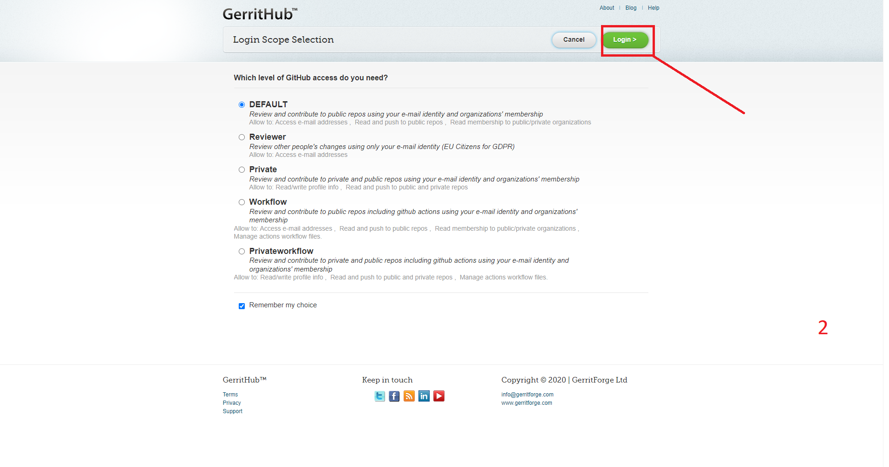
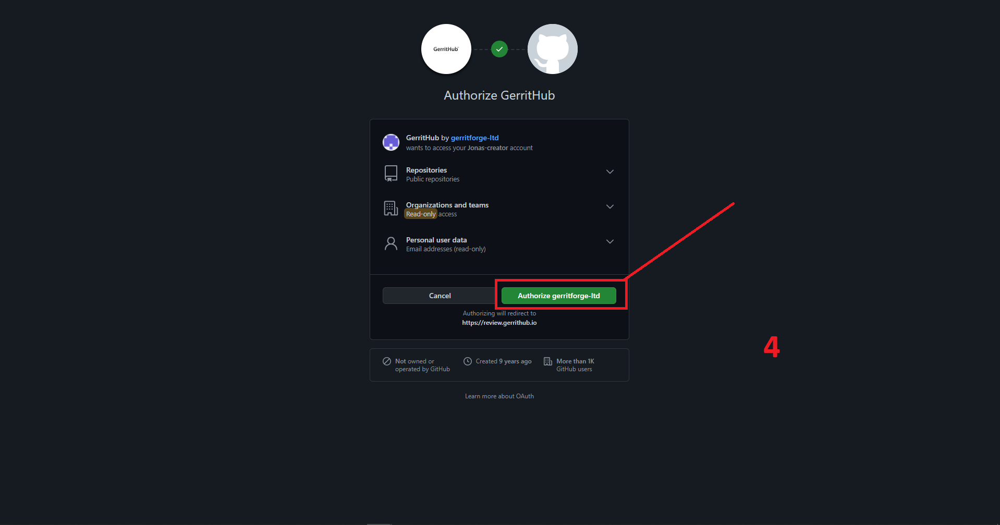
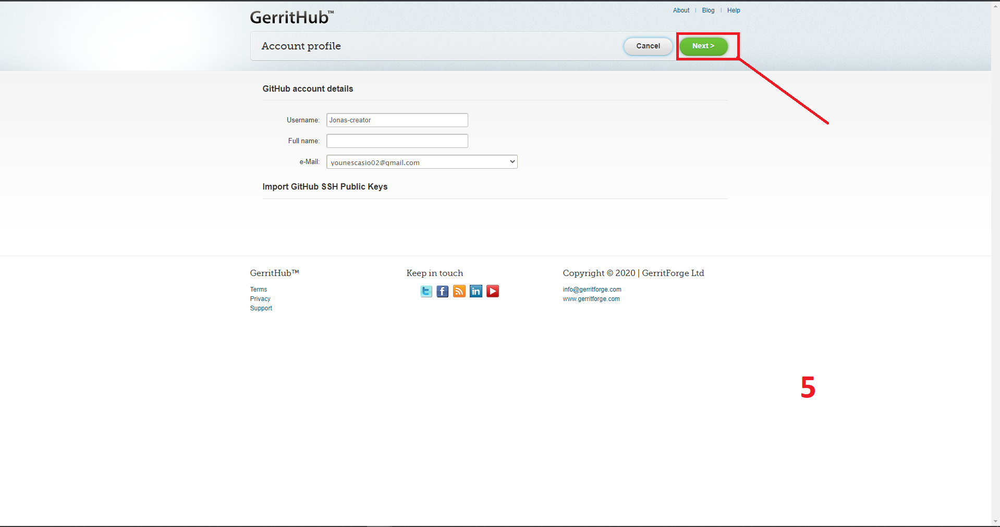
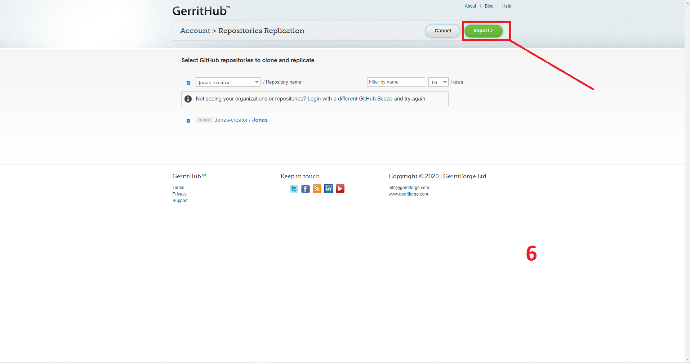
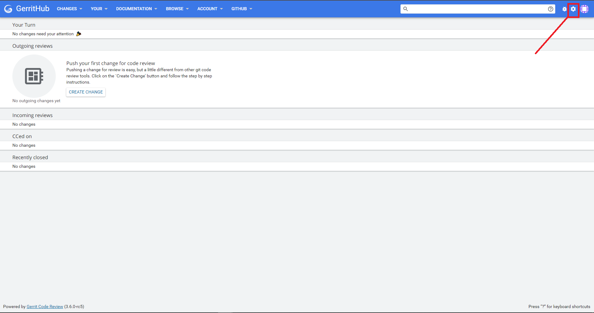
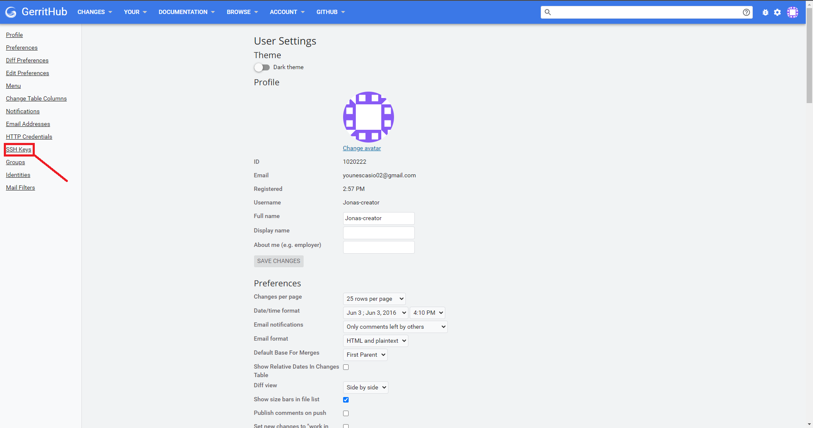
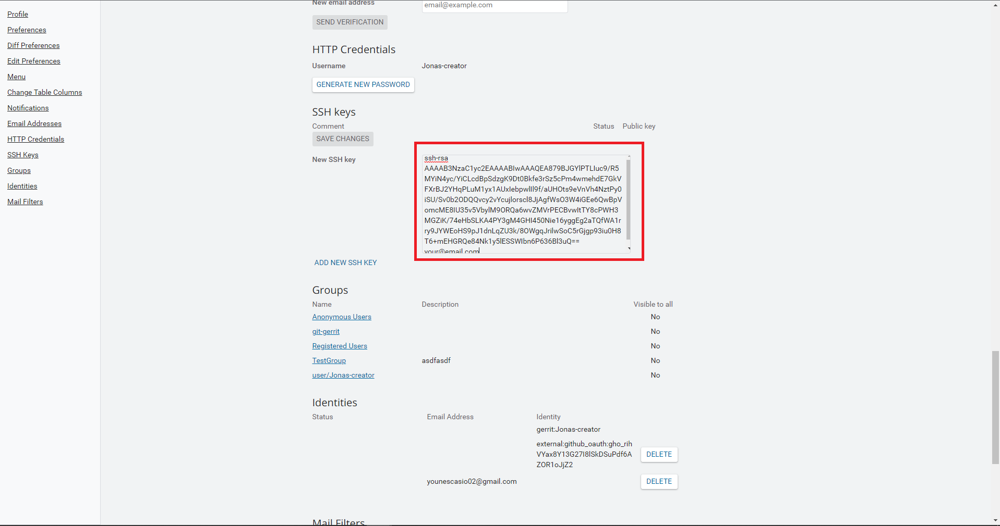
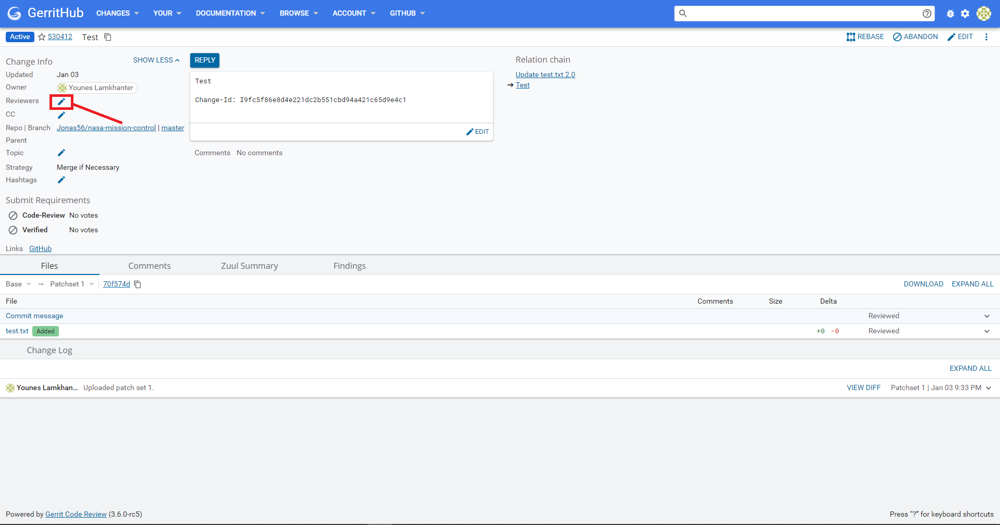
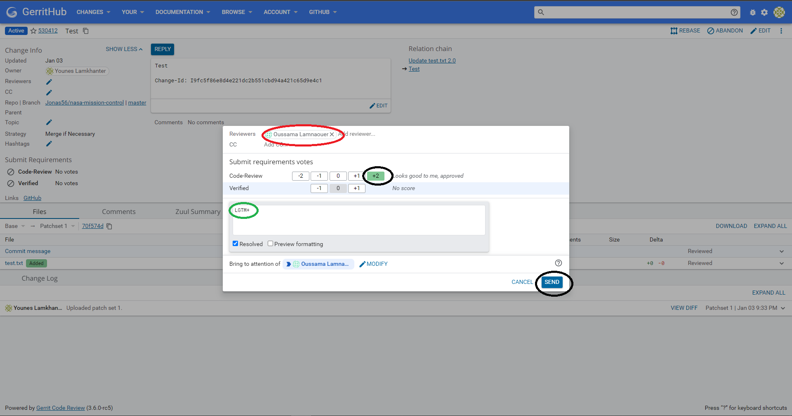
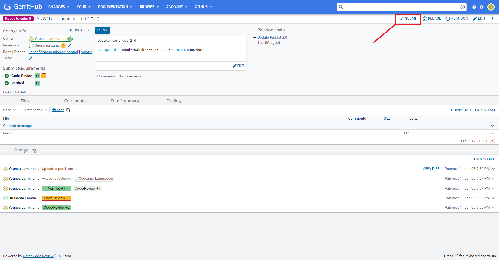

# Gerrit Code Review: Atelier GL

## Table des matières

- [Introduction](#introduction)
- [Installation](#installation-et-configuration)
- [Workshop](#atelier)

## Introduction

Gerrit is a free, web-based team code collaboration tool. Software developers in a team can review each other's modifications on their source code using a Web browser and approve or reject those changes. It integrates closely with Git, a distributed version control system

## Installation et configuration

Before installing gerrit make sure you have

- [Git for windows](https://gitforwindows.org/) or [Git for MacOs](https://git-scm.com/download/mac)
- [JDK](https://www.oracle.com/java/technologies/downloads/#jdk17-windows)

Install Gerrit locally

- [Windows](https://github.com/Sl0v3C/Install_Gerrit_4Windows_Guide)
- [Linux](https://gerrit-documentation.storage.googleapis.com/Documentation/3.5.0.1/linux-quickstart.html)

In our case we will use [GerritHub](http://gerrithub.io/)

**GerritHub** is a public instance of Gerrit Code Review, which provides highly customisable sofisticated security. Whilst right now all GerritHub projects have shared a common public polity for all projects, you can customise your Gerrit project security and further restrict or extends the default permissions.

### Creating Gerrithub account

- Visit this [link](https://review.gerrithub.io/)

<p align=center>
    
</p>

- Click Signin and follow the steps

<p align=center>
      
  </p>

<p>
    
</p>

<p>
    
</p>

<p>
    
</p>

<p>
    
</p>

<p>
    
</p>

### SSH Keys for GerritHub

When working with a GerittHub repository, you'll often need to identify yourself to GerritHub using your username and password. An SSH key is an alternate way to identify yourself that doesn't require you to enter you username and password every time.

SSH keys come in pairs, a public key that gets shared with services like GerritHub, and a private key that is stored only on your computer. If the keys match, you're granted access.

- Generating an SSH key pair

```sh
$ ssh-keygen -t rsa -C "gerrituser@example.com"
> Generating public/private rsa key pair.
> Enter file in which to save the key (/Users/username/.ssh/id_rsa):
> Enter passphrase (empty for no passphrase):
> Enter same passphrase again:
```

- Add your public key to GerritHub

```sh
$ cat ~/.ssh/id_rsa.pub
```

The output should look something like this:

```
ssh-rsa AAAAB3NzaC1yc2EAAAABIwAAAQEA879BJGYlPTLIuc9/R5MYiN4yc/YiCLcdBpSdzgK9Dt0Bkfe3rSz5cPm4wmehdE7GkVFXrBJ2YHqPLuM1yx1AUxIebpwlIl9f/aUHOts9eVnVh4NztPy0iSU/Sv0b2ODQQvcy2vYcujlorscl8JjAgfWsO3W4iGEe6QwBpVomcME8IU35v5VbylM9ORQa6wvZMVrPECBvwItTY8cPWH3MGZiK/74eHbSLKA4PY3gM4GHI450Nie16yggEg2aTQfWA1rry9JYWEoHS9pJ1dnLqZU3k/8OWgqJrilwSoC5rGjgp93iu0H8T6+mEHGRQe84Nk1y5lESSWIbn6P636Bl3uQ== your@email.com
```

Copy the contents of the output to your clipboard.

- Go to **Settings**
<p>
    
</p>

- Select **SSH-Keys** from the side menu
<p>
    
</p>

- Paste the contents of your clipboard into the Key text box.
<p>
    
</p>

## Workshop

- Test connection

```console
$ ssh -p 29418 <username>@review.gerrithub.io
  ****    Welcome to Gerrit Code Review    ****

  Hi Younes Lamkhanter, you have successfully connected over SSH.

  Unfortunately, interactive shells are disabled.
  To clone a hosted Git repository, use:

  git clone ssh://<username>@review.gerrithub.io:29418/REPOSITORY_NAME.git

Connection to review.gerrithub.io closed.
```

- Clone repository on local machine

```console
$ git clone "ssh://Jonas56@review.gerrithub.io:29418/Jonas56/Blog" && scp -p -P 29418 Jonas56@review.gerrithub.io:hooks/commit-msg "Blog/.git/hooks/"
```

- Create a local branch

```bash
$ cd Blog
$ git checkout -b feature:test
```

- Make your changes

- Satge and Commit changes

```console
$ git add README.md
$ git commit -m "Feature test"
```

- Push changes to HEAD:refs/for/feature:test

```console
$ git push origin HEAD:refs/for/feature:test
```

- Switch to Gerrit UI

<p align=center>
    
</p>

- Add reviewers to review my code

<p align=center>
    
</p>

<p align=center>
      
</p>

- Submit code review

<p align=center>
    
</p>

- Switch to your github repository and your changes will be made

# Licence

[](https://opensource.org/licenses/MIT)
